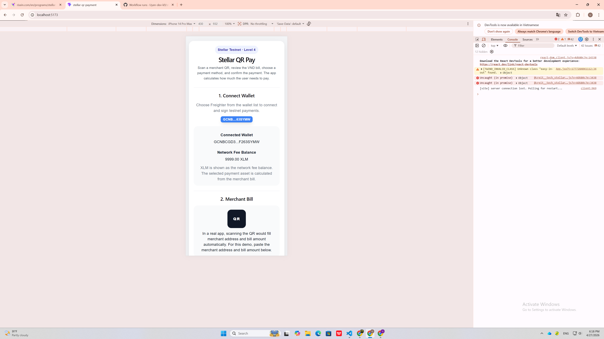
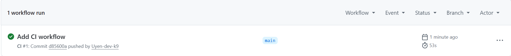
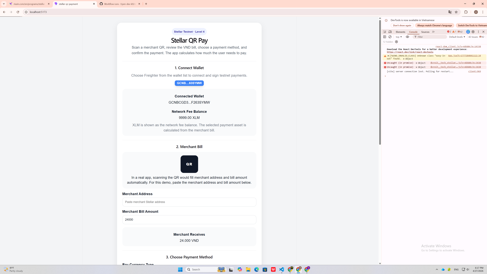

# Stellar QR Pay – Level 4

A QR merchant payment demo built on Stellar Testnet.

The app simulates a real QR payment flow:

```text
Scan merchant QR
→ Read merchant address and VND bill
→ Choose payment method
→ App calculates how much user pays
→ Confirm payment
→ Merchant receives VND payout simulation
```

Level 4 adds a custom testnet settlement token and an inter-contract call between two Soroban contracts.

---

## Level 4 Submission Proof

### Video Demo

https://drive.google.com/file/d/1XFTB4Cax7yKfTojSX27Oihi9Hc_234I4/view?usp=drive_link

### Live Demo

https://stellar-qr-payment.vercel.app/

### Public GitHub Repository

https://github.com/Uyen-dev-k9/stellar-qr-payment

### Mobile Responsive Screenshot



### CI/CD Pipeline



### QR Pay Contract

```text
CA643E5DSSCCZZOKPIFNRAMDZI4TLTFPMJU76724YECIKBJRL5V6QZ6CP
```

### QRUSD Token Contract

```text
CA3Z625FX7EMR33U3UDSDNMF3WLCTZ7FW2XKAGZZ7TPHNF5O74FI5EN5
```

### Successful Inter-Contract Transaction

```text
0020e11184506018a3991bff8b82dce1b815dcb97542b1b79d6bcc43420ecb65
```

### Commit Requirement

```bash
git log --oneline
```

Minimum required: 8+ meaningful commits.

---

## Features

- Wallet connection with StellarWalletsKit and Freighter
- Merchant QR payment simulation
- VND merchant bill input
- Automatic payment amount calculation
- Stablecoin / crypto options: USDC, USDT, ETH
- Fiat options: USD, VND, EUR
- VND payout simulation
- Payment receipt with status, payer, merchant, reference ID, and transaction hash
- Mobile responsive UI
- Error handling
- CI/CD-ready structure

---

## Smart Contract Design

```text
QR Pay Contract
→ stores payment records
→ calls QRUSD Token Contract

QRUSD Token Contract
→ custom testnet token
→ supports initialize, mint, transfer, balance
```

Inter-contract flow:

```text
Frontend
→ QR Pay Contract: pay_with_token()
→ QRUSD Token Contract: transfer()
→ Payment record saved
```

---

## Demo Exchange Rates

```text
USDC → VND: 26,340
USDT → VND: 26,340
ETH  → VND: 61,124,000
USD  → VND: 26,340
VND  → VND: 1
EUR  → VND: 28,500
```

Rates are fixed for demo only. In production, rates should come from a real FX provider, oracle, exchange, or payment partner.

---

## Screenshots

### Desktop View



### Mobile Responsive View


### CI/CD Pipeline


---

## CI/CD

GitHub Actions workflow:

```text
.github/workflows/ci.yml
```

Pipeline:

```bash
npm install
npm run build
```

---

## Tech Stack

- React
- Vite
- Stellar SDK
- StellarWalletsKit
- Freighter Wallet
- Soroban SDK
- Stellar CLI
- Rust
- Stellar Testnet
- GitHub Actions

---

## Local Setup

```bash
git clone https://github.com/Uyen-dev-k9/stellar-qr-payment
cd stellar-qr-payment
npm install
npm run dev
```

Local app:

```text
http://localhost:5173
```

---

## Contract Commands

### Build

```bash
cd contracts/qr_token
stellar contract build

cd ../qr_payment
stellar contract build
```

### Test Inter-Contract Call

```bash
stellar contract invoke \
  --id CA643E5DSSCCZZOKPIFNRAMDZI4TLTFPMJU76724YECIKBJRL5V6QZ6CP \
  --source alice \
  --network testnet \
  --send=yes \
  -- pay_with_token \
  --merchant bob \
  --payer alice \
  --token CA3Z625FX7EMR33U3UDSDNMF3WLCTZ7FW2XKAGZZ7TPHNF5O74FI5EN5 \
  --amount 20 \
  --currency QRUSD
```

---

## Production Notes

This is a testnet demo.

In production:

- Merchant QR should include merchant ID, country, address, and bill amount.
- Exchange rates should come from a real provider or oracle.
- Fiat payments require bank, card, e-wallet, or payment gateway integration.
- Stablecoin settlement should use supported real assets.
- Merchant local fiat payout requires licensed payout partners.
- Compliance and risk checks are required.

---

## Final Checklist

- [ ] Public GitHub repo link added
- [ ] Live demo link added
- [ ] 8+ meaningful commits
- [ ] Mobile responsive screenshot added
- [ ] CI/CD screenshot or badge added
- [ ] QR Pay contract address included
- [ ] QRUSD token address included
- [ ] Inter-contract transaction hash included